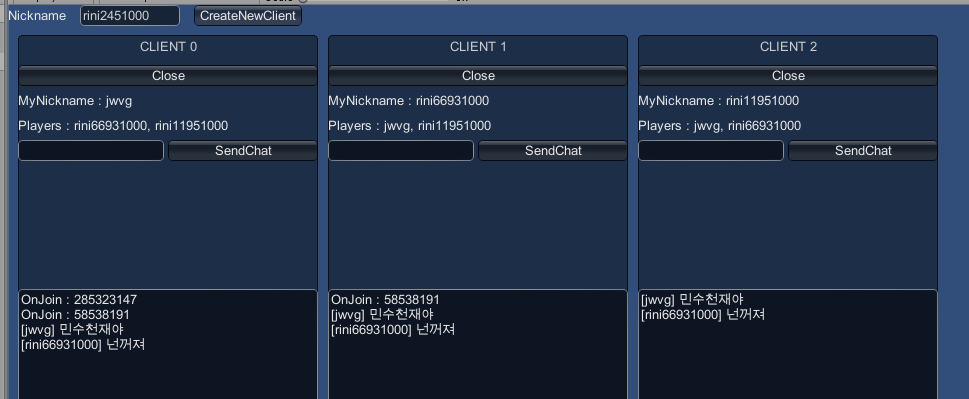

EzClient.Unity
====




서버에 연결하기
----
```cs
// 클라이언트 식별값
var uniqId = (new System.Random()).Next() + 1000;

client = EzClient.Connect(
    "ws://localhost:9916/echo?version=1.0.0&userType=guest&userId=1",
    uniqId,
    new Dictionary<string, object>() {
        {"nickname", nickname}
    }),
```

플레이어 관리
----
__접속중인 플레이어 가져오기__
```cs
foreach(var player in client.players) {
    var playerId = player.PlayerId;
    var nickname = (string)player.Property["nickname"];
}
```

__새로운 접속, 퇴장 처리하기__
```cs
client.onJoinPlayer += (JoinPlayer packet) => {
    var player = packet.Player;

    var playerId = player.PlayerId;
    var nickname = (string)player.Property["nickname"];
};

client.onLeavePlayer += (LeavePlayer packet) => {
    var player = packet.Player;
    
    var playerId = player.PlayerId;
    var nickname = (string)player.Property["nickname"];
};
```

패킷 주고받기
----
__패킷 아이디 정의하기__
```cs
public class PacketType {
    public static readonly int Chat = 1;
}
```

__패킷 브로드캐스팅__
```cs
client.SendPacket(
    PacketType.Chat,
    new Dictionary<string, object>()
    {
        {"message", clientData.chatMessage}
    });
```

__수신하기__
```cs
client.onCustomPacket += (BroadcastPacket packet) =>
{            
    if (packet.Type == PacketType.Chat)
        log += "[" + packet.Sender.Property["nickname"] + "] " + packet.Data["message"] + "\r\n";
};
```
